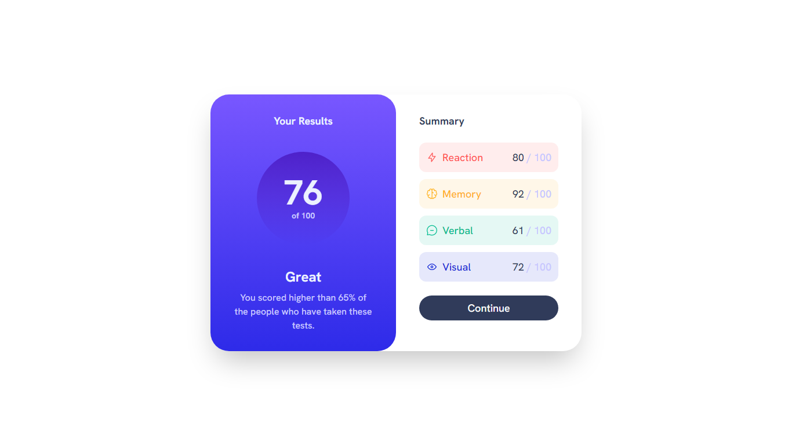

This is a [Next.js Beta](https://beta.nextjs.org/docs) project bootstrapped with [`create-next-app@latest --experimental-app`](https://github.com/vercel/next.js/tree/canary/packages/create-next-app).

## Table of contents

- [Overview](#overview)
- [Repository](#repositorys)
- [Deployment](#deployed-using-vercel)
- [Author](#author)

## Overview

### Screenshot



First, install the [node modules](https://nodejs.org/api/modules.html) using [pnpm](https://pnpm.io):

```bash
pnpm install
```

Then, run the development server using [pnpm](https://pnpm.io):

```bash
pnpm dev
```

Open [http://localhost:3000](http://localhost:3000) with your browser to see the result.

You can start editing the page by modifying `app/page.js`. The page auto-updates as you edit the file.

### Links
- Live Site URL : [Result Summary Component](https://results-summary-component-dun.vercel.app/)

## Repository's

This project uses [`next/font`](https://nextjs.org/docs/basic-features/font-optimization) to automatically optimize and load Inter, a custom Google Font.

This project uses [`tailwindcss`](https://tailwindcss.com/) for styling the page.

## Deployed using Vercel

This website is deployed using the [Vercel Platform](https://vercel.com/new?utm_medium=default-template&filter=next.js&utm_source=create-next-app&utm_campaign=create-next-app-readme) from the creators of Next.js.

## Author
- Website - [Anda Hanise](https://andahanise.kookdevs.com)
- Frontend Mentor - [@budzHors7](https://www.frontendmentor.io/profile/budzHors7)
- Github - [@budzHors7](https://github.com/budzHors7)